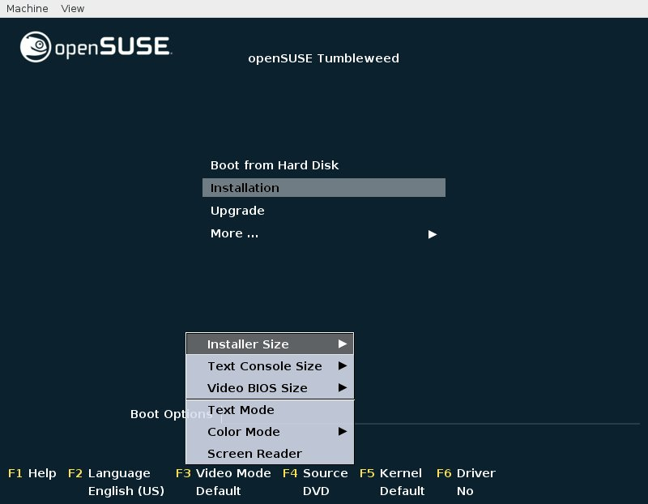
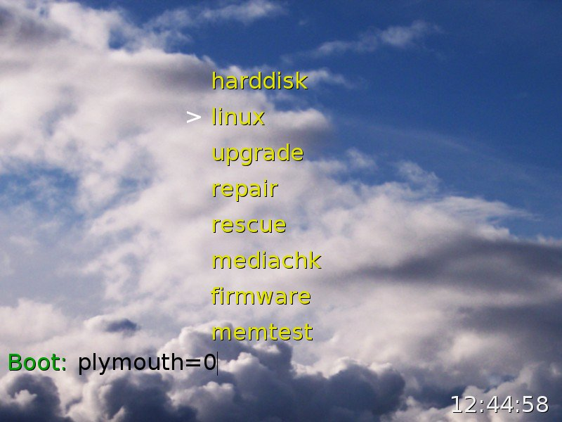

# gfxboot

## About gfxboot

gfxboot is a graphical boot screen for syslinux (up to version 4) and grub1.

Features

  - editable boot options
  - a menu system
  - context sensitive help texts (in html) shown in separate windows
  - support for different keyboard layouts
  - i18n support (localization via po files, Unicode char rendering via freetype lib)
  - text-to-speech support via pc-speaker
  - can run animations and play wav files
  - works via serial line (with text-based menus)

## Downloads

Get the latest version from the [openSUSE Build Service](https://software.opensuse.org/package/gfxboot).

## Examples

It is used by [openSUSE Tumbleweed](http://download.opensuse.org/tumbleweed/iso/openSUSE-Tumbleweed-DVD-x86_64-Current.iso). The boot screen looks like this:



A more minimalistic [example](themes/example_07/example_07.bc) included in the git repository:




## openSUSE Development

To build, simply run `make`. Install with `make install`.

To build a reference for the stack-based bincode (used in `themes/openSUSE/src/*.inc`), run

```console
$ make doc
$ xdg-open doc/gfxboot.html || less doc/gfxboot.txt
```

Basically every new commit into the master branch of the repository will be auto-submitted
to all current SUSE products. No further action is needed except accepting the pull request.

Submissions are managed by a SUSE internal [jenkins](https://jenkins.io) node in the InstallTools tab.

Each time a new commit is integrated into the master branch of the repository,
a new submit request is created to the openSUSE Build Service. The devel project
is [system:install:head](https://build.opensuse.org/package/show/system:install:head/gfxboot).

`*.changes` and version numbers are auto-generated from git commits, you don't have to worry about this.

The spec file is maintained in the Build Service only. If you need to change it for the `master` branch,
submit to the
[devel project](https://build.opensuse.org/package/show/system:install:head/gfxboot)
in the build service directly.

Development happens exclusively in the `master` branch. The branch is used for all current products.

You can find more information about the changes auto-generation and the
tools used for jenkis submissions in the [linuxrc-devtools
documentation](https://github.com/openSUSE/linuxrc-devtools#opensuse-development).
